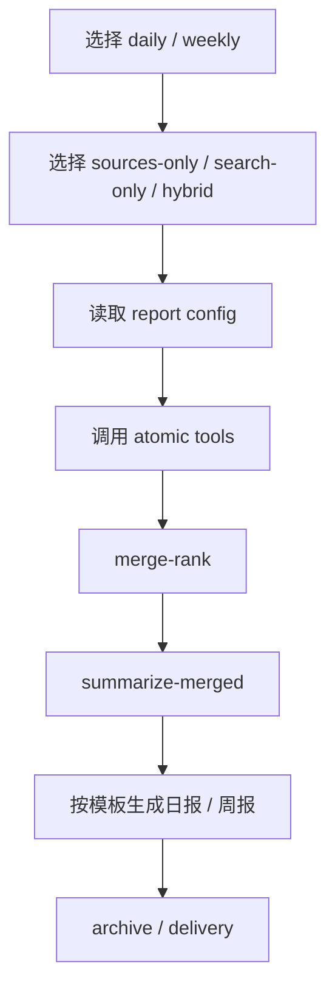

# Tech News Digest

> 说明：这个仓库是基于原始项目 [draco-agent/tech-news-digest](https://github.com/draco-agent/tech-news-digest) 继续改造的社区运营版本。
> 当前版本在运行时、配置结构、模板、HTML source 与 Scout/OpenClaw 集成方式上都做了明显调整。


`tech-news-digest` 是一个面向 **AI 社群运营**、**Scout / OpenClaw 用户** 和 **Discord / Forum 内容发布** 的可复用 skill。

它的目标很直接：
- 从固定信息源抓取 AI 相关新闻
- 在需要时补充显式搜索结果
- 自动整理成 **日报** 或 **周报**
- 输出适合 Discord Forum、社区帖子、邮件简报的内容

## 它适合谁

这套 skill 特别适合下面几类人：
- 运营 AI 社群，需要稳定产出日报 / 周报
- 想跟踪 `OpenAI / Anthropic / Gemini / OpenClaw / n8n / 开源生态`
- 希望把固定源、官方页面和搜索结果合并成一个低噪音 digest
- 想把 Scout-style 原子工具能力接到自己的 runtime 里

## 你可以用它做什么

它支持三种运行方式：
- `sources-only`
  只使用固定信息源，例如 RSS、GitHub、Reddit、HTML 页面源
- `search-only`
  只做显式搜索，例如补查某个厂商或主题
- `hybrid`
  把固定源和显式搜索合并，再统一去重、排序、输出

最终它可以产出：
- AI 日报
- AI 周报
- 统一的 merged 结果池
- 适合 Discord / Forum / Email 的格式化内容

## 这套 skill 的核心特点

- 低噪音：默认优先固定精选源，不默认全网乱搜
- 可控搜索：只有显式提供 `search-targets.json` 才会做 web search
- 支持官方 HTML 页面源：例如 Anthropic Newsroom
- Daily / Weekly 分离：两套配置、两套模板、两种节奏
- 社区友好：日报支持 Reddit `Community Picks`，周报默认不混 Reddit
- 适合持续运营：支持 archive 和去重，避免每天重复同一批事件

## 整体架构

这套 skill 是三层结构：
- 原子工具层：`rss/html/github/reddit/tavily/merge-rank`
- Runtime 编排层：`scripts/scout-runtime.py`
- 顶层业务 skill：`tech-news-digest`

一句话理解：
- 原子工具负责“抓和并”
- runtime 负责“调度这些工具”
- skill 负责“决定 daily / weekly 策略和最终输出”

## 运行流程图



## 3 分钟上手

### 1. 先选一套配置
- 日报：`workspace/daily-report-config`
- 周报：`workspace/weekly-report-config`

### 2. 理解这 3 个核心配置文件
每套配置目录里最重要的是：
- `fixed-sources.json`
  作用：定义固定信息源，也就是“去哪里拿内容”
- `display-topics.json`
  作用：定义最终怎么分栏目、怎么展示
- `search-targets.json`
  作用：定义这次额外要搜索什么。只有显式启用搜索时才会用到

可以这样记：
- `fixed-sources.json` = 内容来源
- `display-topics.json` = 展示结构
- `search-targets.json` = 额外搜索意图

### 3. 准备最小运行环境
你至少需要：
- `python3`
- `workspace/archive/tech-news-digest/` 目录
- 一套可用的 report config

下面这些不是首次运行必需：
- `GITHUB_TOKEN`
- Tavily / Brave 等搜索 key
- `search-targets.json`

也就是说，**只跑固定源日报 / 周报时，不配搜索 key 也能先用起来。**

## 最小启动命令

### 日报：固定源模式
```bash
python3 scripts/scout-runtime.py \
  --mode sources-only \
  --hours 48 --freshness pd \
  --rss-sources workspace/daily-report-config/fixed-sources.json \
  --html-sources workspace/daily-report-config/fixed-sources.json \
  --github-sources workspace/daily-report-config/fixed-sources.json \
  --reddit-sources workspace/daily-report-config/fixed-sources.json \
  --archive-dir workspace/archive/tech-news-digest/ \
  --output /tmp/td-merged.json --verbose
```

### 周报：固定源模式
```bash
python3 scripts/scout-runtime.py \
  --mode sources-only \
  --hours 168 --freshness pw \
  --rss-sources workspace/weekly-report-config/fixed-sources.json \
  --html-sources workspace/weekly-report-config/fixed-sources.json \
  --github-sources workspace/weekly-report-config/fixed-sources.json \
  --archive-dir workspace/archive/tech-news-digest/ \
  --output /tmp/td-merged.json --verbose
```

### 日报：hybrid 模式
```bash
python3 scripts/scout-runtime.py \
  --mode hybrid \
  --hours 48 --freshness pd \
  --rss-sources workspace/daily-report-config/fixed-sources.json \
  --html-sources workspace/daily-report-config/fixed-sources.json \
  --github-sources workspace/daily-report-config/fixed-sources.json \
  --reddit-sources workspace/daily-report-config/fixed-sources.json \
  --search-queries-file workspace/daily-report-config/search-targets.json \
  --archive-dir workspace/archive/tech-news-digest/ \
  --output /tmp/td-merged.json --verbose
```

## 默认策略

### Daily
- 来源：精选 RSS + GitHub + Anthropic HTML + 精选 Reddit
- 默认允许的 Reddit 社区由 daily 配置决定
- 默认不跑 Twitter
- 默认不跑 Web Search
- 默认不跑 GitHub Trending

### Weekly
- 来源：精选 RSS + GitHub + Anthropic HTML
- 默认不带 Reddit
- 默认不跑 Twitter
- 默认不跑 Web Search
- 默认不跑 GitHub Trending

### Search
- 搜索不是默认动作
- 只有显式提供 `search-targets.json` 时才执行
- 更适合补厂商更新、补漏、或做 focused check

## 输出模板

当前推荐模板：
- 日报：`references/templates/openclaw-emoji.md`
- 周报：`references/templates/openclaw-weekly.md`

推荐输出结构：
- `🌍 全球 AI 行业热点`
- `🏢 模型厂商动态`
  - `🟢 OpenAI`
  - `🟠 Anthropic`
  - `🔵 Gemini`
  - `🧪 Open Source`
- `🤖 AI 智能体 / 工作流`
- `🧩 开源社区动态`

Daily 额外规则：
- Reddit 单独作为 `Community Picks`
- Reddit 不进入主版块
- 每个 subreddit 最多 Top 5
- 排序按 `score`，其次 `num_comments`

Anthropic 额外规则：
- 不作为 RSS source 处理
- 统一按官方 HTML 页面源处理：<https://www.anthropic.com/news>

## 文件结构图

```text
tech-news-digest-3.14.0/
|-- SKILL.md
|-- README.md
|-- README_CN.md
|-- .env
|-- .gitignore
|-- _meta.json
|-- config/
|   `-- defaults/
|       |-- sources.json
|       `-- topics.json
|-- references/
|   |-- digest-prompt.md
|   `-- templates/
|       |-- openclaw-emoji.md
|       |-- openclaw-weekly.md
|       |-- discord.md
|       |-- email.md
|       `-- pdf.md
|-- scripts/
|   |-- scout-runtime.py
|   |-- rss-fetch.py
|   |-- html-fetch.py
|   |-- github-fetch.py
|   |-- reddit-fetch.py
|   |-- tavily-search.py
|   |-- merge-rank.py
|   |-- fetch-web.py
|   `-- summarize-merged.py
|-- workspace/
|   |-- archive/
|   |   `-- tech-news-digest/
|   |-- daily-report-config/
|   |   |-- fixed-sources.json
|   |   |-- display-topics.json
|   |   |-- search-targets.json
|   |   `-- search-targets.example.json
|   |-- weekly-report-config/
|   |   |-- fixed-sources.json
|   |   |-- display-topics.json
|   |   `-- search-targets.json
|   `-- docs/
|       |-- README.md
|       |-- CONFIG_NOTES.md
|       |-- SCOUT_ATOMIC_TOOLS.md
|       |-- ANTHROPIC_HTML_SOURCE.md
|       `-- SCOUT_REARCHITECTURE.md
`-- requirements.txt
```

## Secrets 与环境变量

推荐把真实 key 放在本地 `.env` 或系统环境变量里，不要写进 markdown 文档。

当前已兼容：
- `GITHUB_TOKEN`
- `SCOUT_TAVILY_API_KEYS`
- `SCOUT_TAVILY_API_KEY`
- `TAVILY_API_KEYS`
- `TAVILY_API_KEY`

推荐最小写法：

```env
WEB_SEARCH_BACKEND=tavily
SCOUT_TAVILY_API_KEYS=key1,key2
GITHUB_TOKEN=your_github_token_here
```

## 文档阅读顺序

如果你是第一次接触这个 repo，建议这样看：
1. `README.md`
2. `SKILL.md`
3. `workspace/docs/README.md`

再往下需要时再看：
- `workspace/docs/CONFIG_NOTES.md`
- `workspace/docs/SCOUT_ATOMIC_TOOLS.md`
- `workspace/docs/ANTHROPIC_HTML_SOURCE.md`
- `workspace/docs/SCOUT_REARCHITECTURE.md`

## 适合公开发布到 GitHub 吗？

适合。

如果你准备把它作为公开 repo 运营，推荐把它定位成：
- 一个面向 AI 社群运营的 digest skill
- 一个适合 OpenClaw / Scout 的资讯采集与简报生成工具
- 一个可以直接产出 Discord Forum 日报 / 周报的工作流模板

