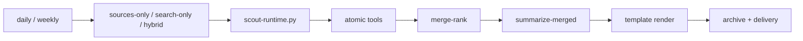

# Tech News Digest

> This repository is a modified, community-oriented derivative of the original [draco-agent/tech-news-digest](https://github.com/draco-agent/tech-news-digest).
> The current version changes the runtime, workspace config layout, template strategy, and Scout/OpenClaw integration flow.

## What This Skill Is

This skill generates AI daily and weekly digests for Scout / OpenClaw.
It can run in three modes:
- `sources-only`: use fixed curated sources only
- `search-only`: use explicit search targets only
- `hybrid`: combine curated sources with explicit search

The preferred runtime entry is:
- `scripts/scout-runtime.py`

## Runtime Flow



This repo is organized into three layers:
- Atomic tool layer: `rss/html/github/reddit/tavily/merge-rank`
- Runtime orchestration layer: `scripts/scout-runtime.py`
- Top-level business skill: `tech-news-digest`

## Canonical Runtime Inputs

Use these workspace files:
- Daily fixed sources: `workspace/daily-report-config/fixed-sources.json`
- Weekly fixed sources: `workspace/weekly-report-config/fixed-sources.json`
- Daily display topics: `workspace/daily-report-config/display-topics.json`
- Weekly display topics: `workspace/weekly-report-config/display-topics.json`
- Daily explicit search targets: `workspace/daily-report-config/search-targets.json`
- Weekly explicit search targets: `workspace/weekly-report-config/search-targets.json`

Their roles are:
- `fixed-sources.json`: where content comes from
- `display-topics.json`: how the final report is grouped and displayed
- `search-targets.json`: what to search only when search is explicitly requested

## Default Policy

### Daily
- Sources: curated RSS + GitHub + Anthropic HTML + selected Reddit
- Current Reddit communities in the daily config:
  - `r/n8n`
  - `r/ClaudeCode`
  - `r/openclaw`
- Twitter disabled by default
- Web search disabled by default
- GitHub Trending disabled by default

### Weekly
- Sources: curated RSS + GitHub + Anthropic HTML
- Reddit disabled by default
- Twitter disabled by default
- Web search disabled by default
- GitHub Trending disabled by default

## Runtime Modes

### `sources-only`
Use only fixed curated sources.
Best for low-cost daily and weekly runs.

### `search-only`
Use only explicit search input.
Best for focused investigation or vendor checks.

### `hybrid`
Use fixed sources plus explicit search targets.
Best when a report needs gap-filling or confirmation from search.

## Quick Start

### Daily runtime
```bash
python3 scripts/scout-runtime.py \
  --mode sources-only \
  --hours 48 --freshness pd \
  --rss-sources workspace/daily-report-config/fixed-sources.json \
  --html-sources workspace/daily-report-config/fixed-sources.json \
  --github-sources workspace/daily-report-config/fixed-sources.json \
  --reddit-sources workspace/daily-report-config/fixed-sources.json \
  --archive-dir workspace/archive/tech-news-digest/ \
  --output /tmp/td-merged.json --verbose
```

### Weekly runtime
```bash
python3 scripts/scout-runtime.py \
  --mode sources-only \
  --hours 168 --freshness pw \
  --rss-sources workspace/weekly-report-config/fixed-sources.json \
  --html-sources workspace/weekly-report-config/fixed-sources.json \
  --github-sources workspace/weekly-report-config/fixed-sources.json \
  --archive-dir workspace/archive/tech-news-digest/ \
  --output /tmp/td-merged.json --verbose
```

### Explicit web search
Use this only when the caller explicitly wants search.

```bash
python3 scripts/fetch-web.py \
  --defaults config/defaults \
  --config workspace/daily-report-config \
  --search-targets workspace/daily-report-config/search-targets.json \
  --freshness pd \
  --output workspace/web-daily.json \
  --verbose --force
```

### Hybrid runtime
```bash
python3 scripts/scout-runtime.py \
  --mode hybrid \
  --hours 48 --freshness pd \
  --rss-sources workspace/daily-report-config/fixed-sources.json \
  --html-sources workspace/daily-report-config/fixed-sources.json \
  --github-sources workspace/daily-report-config/fixed-sources.json \
  --reddit-sources workspace/daily-report-config/fixed-sources.json \
  --search-queries-file workspace/daily-report-config/search-targets.json \
  --archive-dir workspace/archive/tech-news-digest/ \
  --output /tmp/td-merged.json --verbose
```

## Atomic Tools

Current Scout-oriented atomic tools in this repo:
- `scripts/rss-fetch.py`
- `scripts/html-fetch.py`
- `scripts/github-fetch.py`
- `scripts/reddit-fetch.py`
- `scripts/tavily-search.py`
- `scripts/merge-rank.py`

They all aim to return:
- one normalized result envelope
- one normalized article shape
- explicit inputs only
- no hidden report-level business logic

## Output Rules

Preferred templates:
- `references/templates/openclaw-emoji.md` for daily
- `references/templates/openclaw-weekly.md` for weekly

Preferred section structure:
- `🌍 全球 AI 行业热点`
- `🏢 模型厂商动态`
  - `🟢 OpenAI`
  - `🟠 Anthropic`
  - `🔵 Gemini`
  - `🧪 Open Source`
- `🤖 AI 智能体 / 工作流`
- `🧩 开源社区动态`

Daily-specific rules:
- Reddit must be rendered as `Community Picks`
- Reddit should not dominate the main sections
- limit each subreddit to Top 5 posts

Anthropic-specific rule:
- Anthropic is not modeled as RSS
- use the official HTML newsroom page instead: `https://www.anthropic.com/news`

## Secrets

Recommended practice:
- store real API keys in a repo-local `.env` or system environment variables
- do not store real keys in markdown docs

Recommended minimal setup:
```bash
WEB_SEARCH_BACKEND=tavily
SCOUT_TAVILY_API_KEYS=key1,key2
GITHUB_TOKEN=your_github_token_here
```

## Progressive Disclosure

Start here:
- `README.md` for human overview
- `SKILL.md` for agent/platform execution

Only go deeper when needed:
- `workspace/docs/README.md` for doc index
- `workspace/docs/CONFIG_NOTES.md` for operational defaults
- `workspace/docs/SCOUT_ATOMIC_TOOLS.md` for tool contract details
- `workspace/docs/ANTHROPIC_HTML_SOURCE.md` for Anthropic extractor details
- `workspace/docs/SCOUT_REARCHITECTURE.md` for broader Scout migration design


